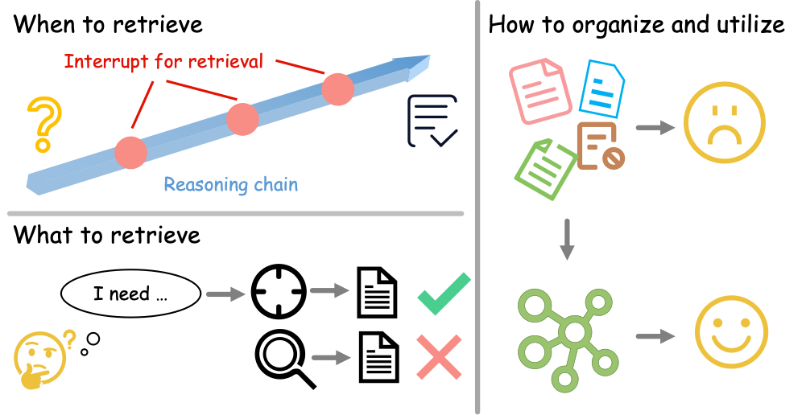
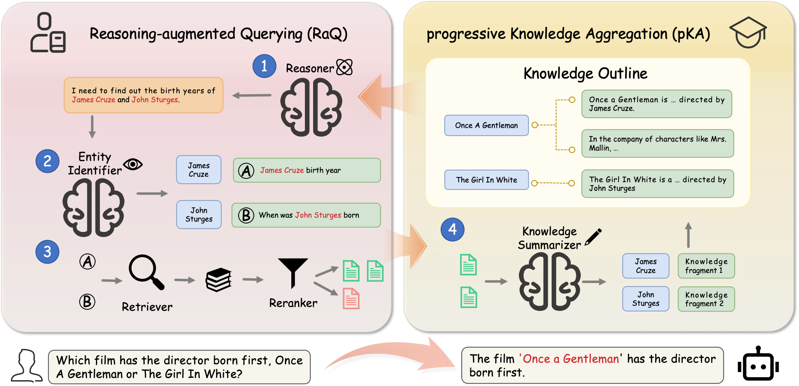

# <h1 align="center"> DualRAG: A Dual-Process Approach to Integrate Reasoning and Retrieval for Multi-Hop Question Answering </h1>

This is the repository for our ACL 2025 paper ["DualRAG: A Dual-Process Approach to Integrate Reasoning and Retrieval for Multi-Hop Question Answering"](https://aclanthology.org/2025.acl-long.1539/).

<div style="text-align: center;">
  
</div>



## <a name="quick_start"></a>:flight_departure:Quick Start

1. Installation

  ```bash
  uv sync --extra llm --extra retrieve
  ```

2. Retriever

  ```bash
  cd server/embedder
  ./run.sh

  cd server/retriever
  ./run.sh
  ```

3. LLM Servers

  ```bash
  cd server/vllm
  ./run_qwen.sh
  ```

4. Run

  ```bash
  python main.py
  ```

  - The experiment configurations are in `config/`. You can find the configs for different systems, models, and datasets there.

  - The output will be saved in `output/`. You can find the logs in the corresponding subdirectory.


## :email: Contact

For questions about code or paper, please email `chengrong@tju.edu.cn`.

For authorization and collaboration inquiries, please email `yanzheng@tju.edu.cn` or `jianye.hao@tju.edu.cn`.

# Citation

If you find this work useful, consider citing it:

```bib
@inproceedings{cheng-etal-2025-dualrag,
    title = "{D}ual{RAG}: A Dual-Process Approach to Integrate Reasoning and Retrieval for Multi-Hop Question Answering",
    author = "Cheng, Rong  and
      Liu, Jinyi  and
      Zheng, Yan  and
      Ni, Fei  and
      Du, Jiazhen  and
      Mao, Hangyu  and
      Zhang, Fuzheng  and
      Wang, Bo  and
      Hao, Jianye",
    editor = "Che, Wanxiang  and
      Nabende, Joyce  and
      Shutova, Ekaterina  and
      Pilehvar, Mohammad Taher",
    booktitle = "Proceedings of the 63rd Annual Meeting of the Association for Computational Linguistics (Volume 1: Long Papers)",
    month = jul,
    year = "2025",
    address = "Vienna, Austria",
    publisher = "Association for Computational Linguistics",
    url = "https://aclanthology.org/2025.acl-long.1539/",
    doi = "10.18653/v1/2025.acl-long.1539",
    pages = "31877--31899",
    ISBN = "979-8-89176-251-0",
    abstract = "Multi-Hop Question Answering (MHQA) tasks permeate real-world applications, posing challenges in orchestrating multi-step reasoning across diverse knowledge domains. While existing approaches have been improved with iterative retrieval, they still struggle to identify and organize dynamic knowledge. To address this, we propose DualRAG, a synergistic dual-process framework that seamlessly integrates reasoning and retrieval. DualRAG operates through two tightly coupled processes: Reasoning-augmented Querying (RaQ) and progressive Knowledge Aggregation (pKA). They work in concert: as RaQ navigates the reasoning path and generates targeted queries, pKA ensures that newly acquired knowledge is systematically integrated to support coherent reasoning. This creates a virtuous cycle of knowledge enrichment and reasoning refinement. Through targeted fine-tuning, DualRAG preserves its sophisticated reasoning and retrieval capabilities even in smaller-scale models, demonstrating its versatility and core advantages across different scales. Extensive experiments demonstrate that this dual-process approach substantially improves answer accuracy and coherence, approaching, and in some cases surpassing, the performance achieved with oracle knowledge access. These results establish DualRAG as a robust and efficient solution for complex multi-hop reasoning tasks."
}
```